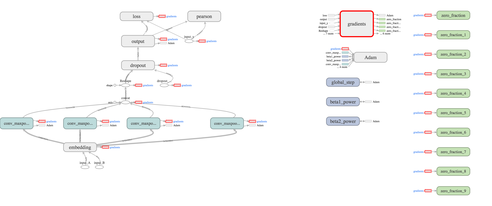
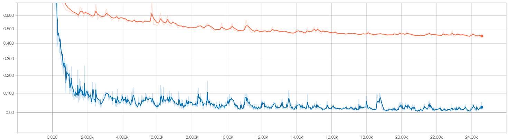
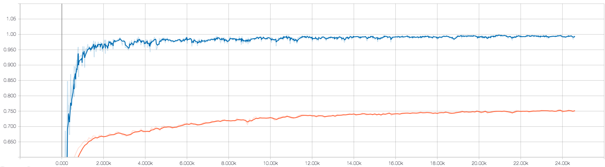

**This is a model fitting the measure of similarity between two sentences**

## Train:
Run the script named train.py

```bash
$python train.py
```

and view the result in Tensorboard

```bash
$tensorboard --logdir='your/path/to/writing/directory'
```

## Model Details.

Four scripts of python codes.

1. Model.py (layers, activation functions.etc)
2. data_helper.py (functions used for data manipulation)
3. train.py (steps of training process)
4. eval.py (optional, evaluate the result of the model.)

## 1. Preparation.
Each row is a pre-trained word vector and the **word** is placed at the **start** of that line. The large quantity of words in these text files will make the computer get stuck when viewing them. So in this case, I will use `head`, a **bash** command to show a couple of lines.

```bash
$head -6 data/glove.6B.100d.txt          # show top 6 lines
``` 
At the beginning, I'll only use 100-dimension word vector to practice.

### Display words
Since the words are placed at the beginning of each line, I use bash command, `awk`, to display the first element and show 

```bash
$awk '{print $1}' data/glove.6B.100d.txt | head -6       # display the first element of top six lines (single quotes)
```

### Count the number of words
Equivalent to counting lines. use `wc`.

```bash
$wc -l data/glove.6B.100d.txt           # output the number of rows    
```
The output is 400000

### Count the dimension 
Equivalent to counting the number of words at each line then minus 1
```bash
$head -1 data/glove.6B.100d.txt | wc -w     # count the words 
```
The output will be 101 and after subtracting 1, the result will be 100.

## Load dataset
According to this [blog](https://blog.csdn.net/Irving_zhang/article/details/69440789), I will use [**SICK.txt**](http://clic.cimec.unitn.it/composes/sick.html) as the data set on which the model will be trained. Here I will let the raw file go through some transformation before input.

### Extract sentences and their relation scores
I firstly display a few rows of this dataset by using `head`:
```bash
$head -3 SICK.txt       # display the top three lines
```
I found that the sentence A and B and the relative scores are at column 2, 3, 5. Then I am going to use `awk` to extract all of these three columns. And separate them by '\t'.

```bash
$awk -F '\t' '{print $2"\t"$3"\t"$5}' SICK.txt > SICK_data.txt
```
Then I could load them into python by using pandas. 

## 2. data_helper.py
In NLP, text data should be processed before being fed to model to train. Mostly we should segment sentence to words and tokenize them. Then mapping them to dense vectors  and use them as inputs. 

`word_vector(file_path, max_sentence_length)`: a class that initialize a word dictionary, pre-trained word vector, and a tensorflow vocabulary processor.

`clean_str(string)`: A function that is able to clean or reform the string. 

`load_data(file_path)`: load input data.

`batches_generator(data, epoch_size, batch_size, shuffle=True)`: generate a set of batches on which the model will be trained.

## 3. CNN_MODEL.py
A model used in this project. According to the [blog](http://arxiv.org/abs/1408.5882) whose coding structure help me a lot, my model has a convolutional layer with different filter sizes followed by max pooling and end with a fully-connected layer.

`CNN(sequence_len, embedding_size, filter_sizes, num_filters, word_vector, l2_reg_lambda=0.0)`: define a CNN model with specific *sequence length*, *embedding_size*, *filter_sizes*, *number of filters*, and a pre-trained *word vectors*. 



## 4. Results
The loss on train set finally stop at 0.0176 and the pearson correaltion at the final batch is 0.9949. However, it looks worse on test set whose values are 0.447 and 0.753. The model overfit the train set. 


The changing loss during training.

The changing pearson correlation during training.